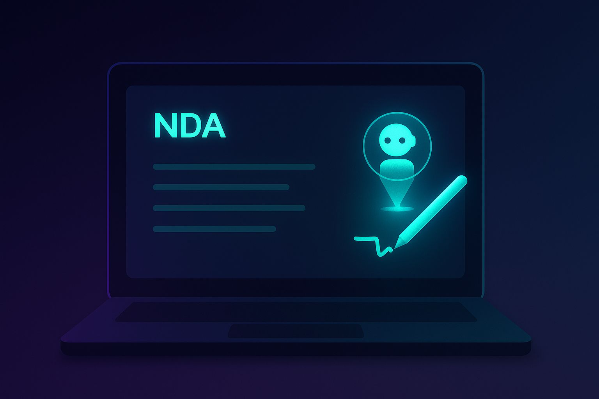
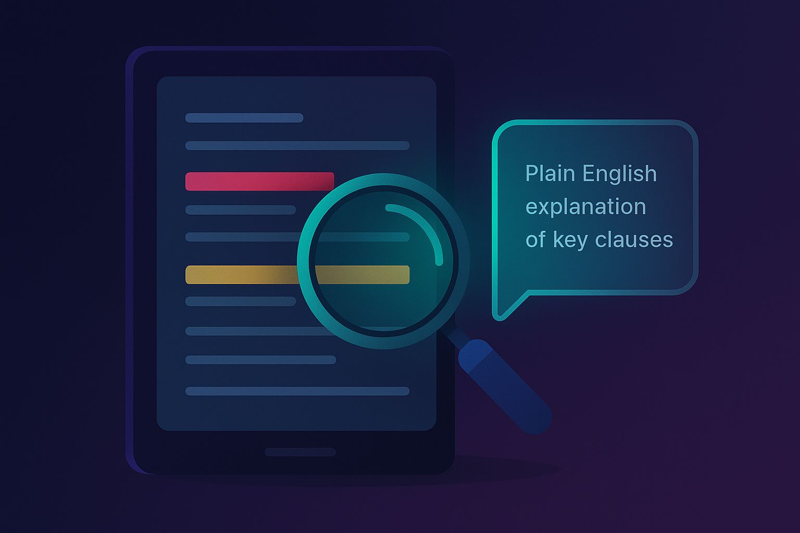
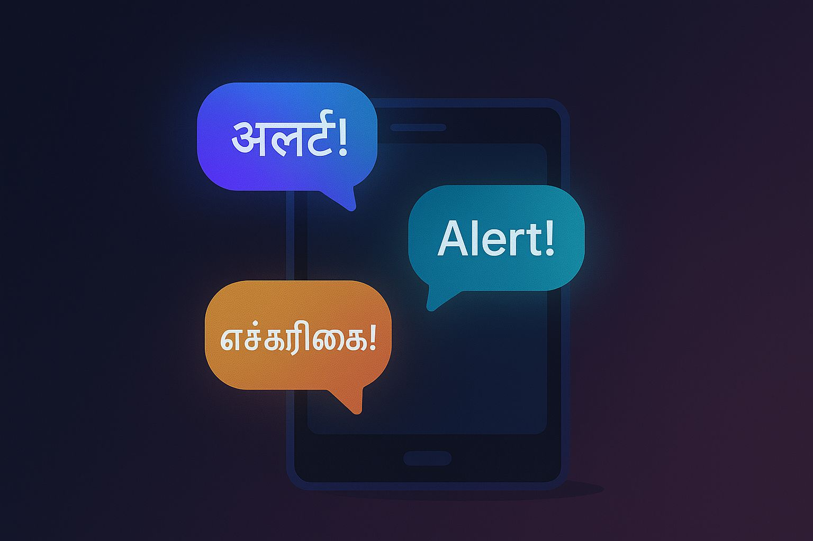
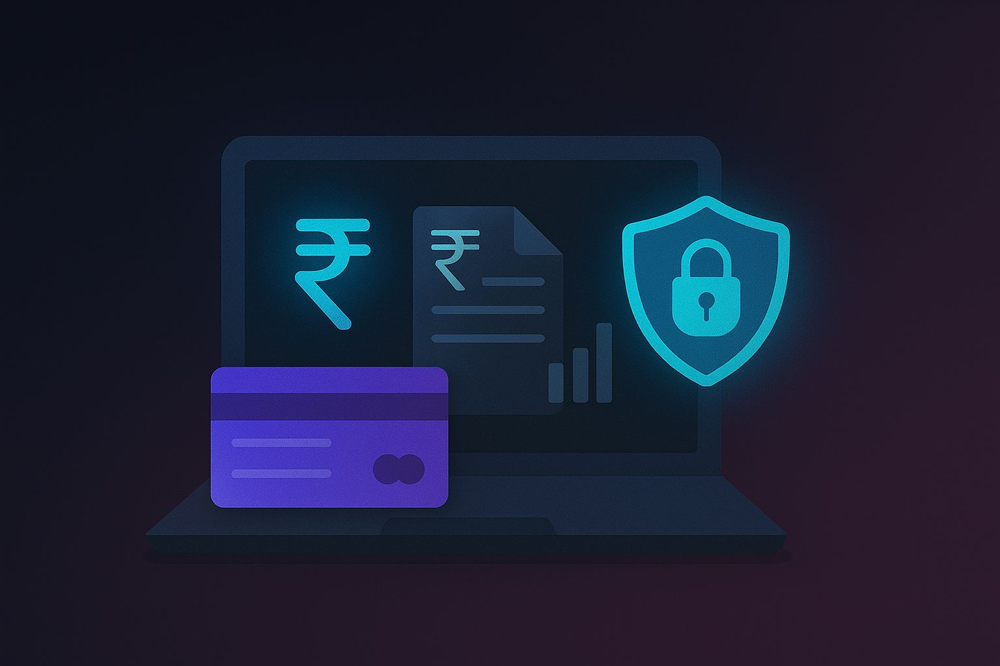
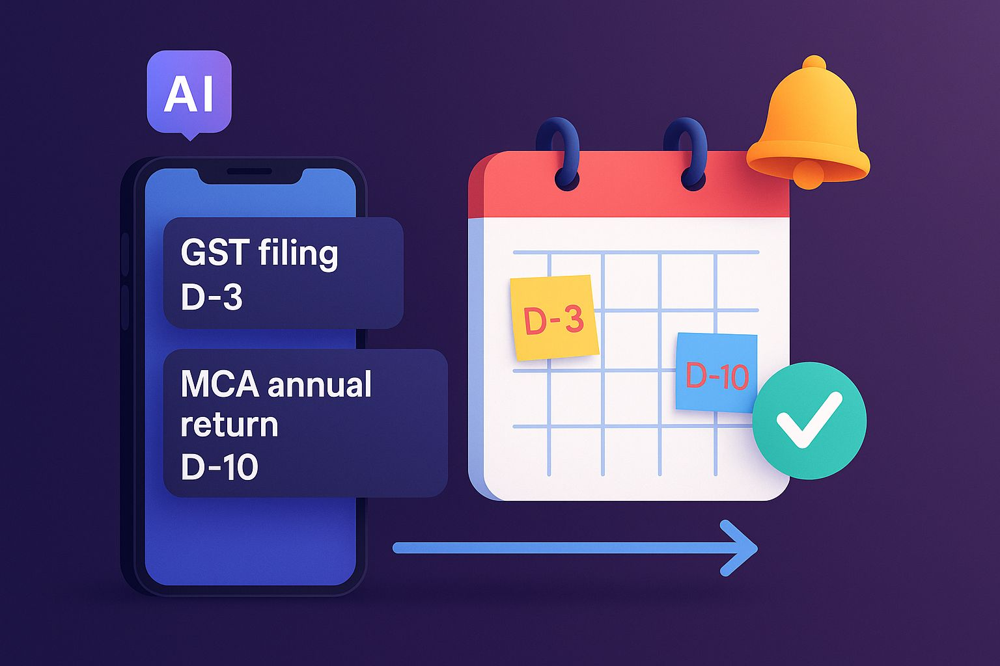
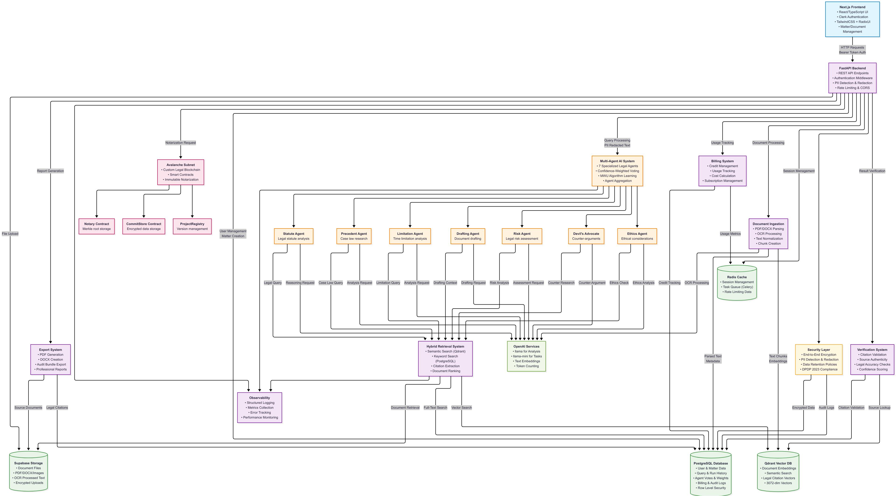

# ⚖️ OPAL – Avalanche Subnet GenAI Legal Co-Counsel for India

<div align="center">
  
  
  **Empowering Indian lawyers with AI & Blockchain – Trust, Transparency, Compliance.**


  [](https://avax.network/)
  
</div>

---

## 🎯 Overview

**OPAL** (Open-Source Private AI for Law) is a next-generation GenAI-powered legal co-counsel platform, purpose-built for Indian lawyers. It combines advanced multi-agent AI reasoning, hybrid legal research, and blockchain notarization on a custom Avalanche Subnet for trust, transparency, and compliance with Indian legal standards.

The platform leverages a sophisticated **DAO of Agents** architecture where multiple specialized AI agents collaborate through a democratic voting mechanism to provide comprehensive legal analysis, ensuring accuracy and reducing hallucination through collective intelligence.

---

## 🖼️ Screenshots

<div align="center">

### Landing Page


*Modern, intuitive landing page showcasing OPAL's AI-powered legal research capabilities*

### Agent Dashboard


*Visual representation of the multi-agent system with specialized legal AI agents*

### Legal Research Interface


*Advanced legal research interface with semantic search and citation verification*

### Blockchain Notarization


*Avalanche subnet integration for immutable legal research notarization*

### Document Analysis


*AI-powered document analysis with automated citation extraction and verification*

### Security & Compliance Dashboard


*Comprehensive security and compliance monitoring with DPDP 2023 compliance*

</div>

---

## ✨ Key Features

### 🤖 **Multi-Agent Legal AI System (DAO of Agents)**
- **Statute Agent** – Analyzes statutory provisions and legal frameworks
- **Precedent Agent** – Examines case law and judicial precedents
- **Limitation Agent** – Checks time limitations and procedural deadlines
- **Risk Agent** – Assesses legal risks and potential outcomes
- **Devil's Advocate Agent** – Challenges arguments and identifies weaknesses
- **Ethics Agent** – Ensures professional conduct and ethical compliance
- **Drafting Agent** – Assists with legal document preparation

### 🗳️ **Democratic Voting Mechanism**
- **Confidence-Weighted Voting** – Agents vote based on confidence levels
- **Multiplicative Weight Updates (MWU)** – Dynamic weight adjustment based on performance
- **Subdomain Specialization** – Different agent weights for different legal areas
- **Alignment Detection** – Identifies consensus among agents for reliability

### 🔍 **Hybrid Legal Research Engine**
- **Semantic Search** – Qdrant vector database for contextual legal research
- **Keyword Search** – PostgreSQL full-text search for precise term matching
- **Citation Verification** – Automatic legal citation extraction and validation
- **Multi-Court Filtering** – Supreme Court, High Courts, and Tribunal decisions

### 📜 **Avalanche Subnet Integration**
- **Immutable Notarization** – Merkle root storage for tamper-proof verification
- **Smart Contracts** – Solidity contracts for transparent operations
- **Encrypted Evidence Storage** – AES-GCM encrypted audit trails
- **Gas-Free Operations** – Server covers all blockchain transaction costs

### 🔐 **Enterprise-Grade Security**
- **End-to-End AES-256 Encryption** – Envelope encryption for sensitive data
- **Automatic PII Detection & Redaction** – GDPR/DPDP 2023 compliance
- **Row Level Security** – Multi-tenant data isolation
- **Crypto-Shredding** – Secure data deletion for privacy compliance
- **Audit Trails** – Immutable logging of all operations

### 📊 **Compliance & Auditability**
- **DPDP 2023 Compliance** – Full compliance with Indian data protection laws
- **Cryptographic Anchoring** – Every AI output anchored on-chain
- **Data Retention Policies** – Automated data lifecycle management
- **Export Capabilities** – PDF/DOCX report generation with citations

## 🏗️ System Architecture

<div align="center">


*Comprehensive OPAL architecture showing the complete flow from user input through multi-agent processing to blockchain notarization*
</div>

The OPAL platform follows a microservices architecture with the following key components:

### **Frontend Layer**
- **Next.js Application** – Modern React-based user interface
- **Clerk Authentication** – Secure user authentication and authorization
- **Real-time Updates** – WebSocket connections for live agent updates

### **API Gateway & Backend**
- **FastAPI Server** – High-performance Python backend
- **Rate Limiting** – Request throttling and quota management
- **Security Middleware** – JWT validation, CORS, and input sanitization

### **Multi-Agent System**
- **Agent Orchestrator** – Coordinates agent execution and voting
- **Specialized Agents** – 7 domain-specific legal AI agents
- **Voting Mechanism** – Democratic consensus with confidence weighting
- **Weight Management** – Dynamic agent weight updates using MWU algorithm

### **Data Layer**
- **PostgreSQL** – Primary database with full-text search
- **Qdrant Vector DB** – Semantic search for legal documents
- **Redis Cache** – Session management and query caching
- **Supabase Storage** – Encrypted document storage

### **Blockchain Layer**
- **Custom Avalanche Subnet** – Legal-specific blockchain network
- **Smart Contracts** – Notary, CommitStore, and ProjectRegistry
- **Subnet Validators** – Decentralized network validation
- **Immutable Audit Trails** – Cryptographic proof of research integrity

### **Security & Compliance**
- **AES-256 Encryption** – End-to-end data protection
- **PII Detection** – Automated personal information redaction
- **Data Retention** – Automated lifecycle management
- **Audit Logging** – Comprehensive compliance tracking

## 🔗 Avalanche Subnet Integration

### Why Avalanche Subnet?

OPAL operates on a **custom Avalanche subnet** specifically designed for legal research notarization and compliance:

- **🏛️ Custom Blockchain** – Tailored for legal research notarization & evidence storage
- **📜 Smart Contracts** – Immutable proofs & encrypted evidence with zero gas fees
- **🔍 Transparency** – Every AI output cryptographically anchored on-chain
- **⚖️ Compliance** – Supports comprehensive audit trails for Indian legal standards
- **🚀 Performance** – Sub-second finality with high throughput
- **💰 Cost-Effective** – Predictable costs with server-covered transaction fees

### Smart Contract Architecture

#### **Notary.sol** - Research Notarization
```solidity
// Immutable notarization of legal research runs
contract Notary {
    mapping(bytes32 => bytes32) public roots;
    
    function publish(bytes32 runId, bytes32 rootHash) external;
    function get(bytes32 runId) external view returns (bytes32);
    function isNotarized(bytes32 runId) external view returns (bool);
}
```

#### **CommitStore.sol** - Encrypted Evidence Storage
```solidity
// Opaque encrypted commit storage
contract CommitStore {
    mapping(bytes32 => bytes) private blob;
    mapping(bytes32 => bytes32) public labelHashes;
    
    function commit(bytes32 id, bytes32 labelHash, bytes calldata ciphertext, bytes32 dataHash) external;
    function get(bytes32 id) external view returns (bytes memory);
}
```

#### **ProjectRegistry.sol** - Version Management
```solidity
// Immutable registry of project versions
contract ProjectRegistry {
    struct ReleaseInfo {
        bytes32 sourceHash;
        bytes32 artifactHash;
        uint256 timestamp;
        string version;
    }
    
    function register(bytes32 versionId, bytes32 sourceHash, bytes32 artifactHash, string calldata version) external;
}
```

### Subnet Configuration
- **Chain ID**: 43210 (Custom)
- **Block Time**: 1 second
- **Gas Limit**: 15M per block
- **Validators**: 5 initial validators with PoS consensus
- **Native Token**: OPAL (for internal operations)

---

## 🤖 DAO of Agents: Multi-Agent Architecture

### Agent Specialization

<div align="center">
<table>
<tr>
<td align="center"><br/><strong>Statute Agent</strong><br/>Legal Frameworks</td>
<td align="center"><br/><strong>Precedent Agent</strong><br/>Case Law Analysis</td>
<td align="center"><br/><strong>Limitation Agent</strong><br/>Time Limitations</td>
<td align="center"><br/><strong>Risk Agent</strong><br/>Legal Risk Assessment</td>
</tr>
<tr>
<td align="center"><br/><strong>Devil's Advocate</strong><br/>Argument Challenges</td>
<td align="center"><br/><strong>Ethics Agent</strong><br/>Professional Conduct</td>
<td align="center"><br/><strong>Drafting Agent</strong><br/>Document Preparation</td>
<td align="center"><strong>🗳️</strong><br/><strong>Aggregator</strong><br/>Democratic Voting</td>
</tr>
</table>
</div>

### Voting Mechanism

The system implements a sophisticated **Multiplicative Weight Updates (MWU)** algorithm:

1. **Initial Weights**: Each agent starts with domain-specific weights
2. **Confidence Scoring**: Agents provide confidence scores (0.0-1.0) with their responses
3. **Alignment Detection**: System identifies which agents agree with the synthesized answer
4. **Weight Updates**: Aligned agents get weight increases, misaligned agents get decreases
5. **Subdomain Adaptation**: Different legal areas have different optimal agent weights

```python
# Example weight configuration for Criminal Law
CRIMINAL_WEIGHTS = {
    "statute": 1.7,      # High - IPC/CrPC provisions critical
    "precedent": 1.5,    # High - Criminal precedents important  
    "limitation": 1.6,   # High - Time limits critical
    "risk": 1.8,         # Very High - Liberty at stake
    "devil": 1.3,        # Medium-High - Important for defense
    "ethics": 1.4,       # Medium-High - Professional conduct critical
    "drafting": 0.7,     # Low - Less about drafting
}
```

### Agent Workflows

Each agent follows a specialized workflow:

1. **Query Analysis** – Understanding the legal question context
2. **Knowledge Retrieval** – Accessing relevant legal databases
3. **Domain Processing** – Applying specialized legal reasoning
4. **Confidence Assessment** – Self-evaluating response quality
5. **Collaborative Voting** – Participating in democratic decision-making  

## 🛡️ Security & Compliance

### Data Protection Architecture

#### **Envelope Encryption (AES-256)**
```python
# Multi-layer encryption for sensitive data
def encrypt_user_input(plaintext: str) -> Dict[str, str]:
    # Generate random data key
    data_key = AESGCM.generate_key(bit_length=256)
    
    # Encrypt data with data key
    ciphertext = aesgcm_data.encrypt(nonce, plaintext.encode(), aad)
    
    # Encrypt data key with master key (envelope encryption)
    encrypted_data_key = aesgcm_master.encrypt(key_nonce, data_key, None)
    
    return {
        "ciphertext": base64.b64encode(ciphertext).decode(),
        "encrypted_key": base64.b64encode(encrypted_data_key).decode(),
        # ... metadata
    }
```

#### **PII Detection & Redaction**
- **Automatic Detection** – Identifies personal information in legal documents
- **Context-Aware Redaction** – Preserves legal context while protecting privacy
- **Reversible Masking** – Authorized users can unmask when necessary
- **Audit Logging** – All PII operations logged for compliance

#### **Data Retention & Crypto-Shredding**
```python
class DataRetentionManager:
    def __init__(self):
        self.default_retention_days = 180  # DPDP 2023 compliance
        self.pii_retention_days = 90       # Shorter for sensitive data
        self.crypto_shred_delay_hours = 24 # Recovery window
```

### Compliance Features

#### **DPDP 2023 (Digital Personal Data Protection Act)**
- ✅ **Data Minimization** – Collect only necessary legal data
- ✅ **Purpose Limitation** – Data used only for legal research
- ✅ **Storage Limitation** – Automatic deletion after retention period
- ✅ **Consent Management** – Clear consent mechanisms for data processing
- ✅ **Right to Erasure** – Crypto-shredding for secure deletion
- ✅ **Data Portability** – Export capabilities for user data
- ✅ **Breach Notification** – Automated incident response

#### **Legal Professional Standards**
- **Bar Council Rules** – Compliance with professional conduct rules
- **Client Confidentiality** – Attorney-client privilege protection
- **Conflict Checking** – Automated conflict of interest detection
- **Audit Trails** – Complete research history for professional accountability  

## 📦 Technology Stack

### **Frontend Architecture**
```typescript
// Modern React/Next.js with TypeScript
- Framework: Next.js 15.2.4 (App Router)
- Language: TypeScript 5.0+
- Styling: TailwindCSS + Radix UI
- Authentication: Clerk Auth
- State Management: Zustand + React Query
- Charts: Recharts
- Icons: Lucide React
```

### **Backend Architecture**
```python
# High-performance Python backend
- Framework: FastAPI 0.109.0
- Language: Python 3.11+
- ORM: SQLAlchemy 2.0 (async)
- Task Queue: Celery + Redis
- API Documentation: OpenAPI/Swagger
- Monitoring: Structlog + Prometheus
- Testing: Pytest + AsyncIO
```

### **AI & Machine Learning**
```python
# Multi-model AI architecture
- Primary LLM: OpenAI GPT-4o
- Embeddings: OpenAI text-embedding-3-large
- Vector Database: Qdrant (semantic search)
- Agent Framework: Custom multi-agent system
- Confidence Scoring: Ensemble methods
- Hallucination Detection: Cross-validation
```

### **Database & Storage**
```sql
-- Multi-database architecture
- Primary DB: PostgreSQL 15+ (with full-text search)
- Vector DB: Qdrant (legal document embeddings)
- Cache: Redis 7+ (session & query caching)
- File Storage: Supabase Storage (encrypted documents)
- Search: Hybrid semantic + keyword search
```

### **Blockchain & Smart Contracts**
```solidity
// Avalanche Subnet Integration
- Blockchain: Custom Avalanche Subnet
- Smart Contracts: Solidity 0.8.20
- Development: Hardhat + TypeScript
- Testing: Hardhat + Chai
- Deployment: Automated CI/CD pipeline
```

### **DevOps & Infrastructure**
```yaml
# Production-ready deployment
- Containerization: Docker + Docker Compose
- Orchestration: Kubernetes (production)
- CI/CD: GitHub Actions
- Monitoring: Grafana + Prometheus + Loki
- Logging: Structured logging with correlation IDs
- Security: HTTPS, JWT, Rate limiting
```  

## 📝 How It Works

### 1. **Document Ingestion Pipeline**
```
Upload Document → File Type Detection → PDF/DOCX Processing → Text Extraction → 
Paragraph Segmentation → Metadata Extraction → Document Chunking → 
Embedding Generation → Vector Indexing → FTS Indexing → Document Ready
```

### 2. **Multi-Agent Query Processing Workflow**

1. **User Query Submission** – Legal question submitted through web interface
2. **PII Detection & Redaction** – Automatic identification and masking of personal data
3. **Agent Orchestration** – Query routed to specialized legal AI agents
4. **Parallel Processing** – Agents work simultaneously on different aspects:
   - **Statute Agent** → Analyzes relevant laws and regulations
   - **Precedent Agent** → Searches case law and judicial precedents  
   - **Risk Agent** → Assesses potential legal risks and outcomes
   - **Ethics Agent** → Ensures professional conduct compliance
5. **Confidence Scoring** – Each agent provides confidence level (0.0-1.0)
6. **Democratic Voting** – Agents participate in weighted consensus mechanism
7. **Response Synthesis** – Aggregator combines agent outputs using MWU algorithm
8. **Blockchain Notarization** – Research run notarized on Avalanche subnet
9. **Citation Verification** – Legal citations validated and linked
10. **Report Generation** – Comprehensive legal analysis delivered to user

### 3. **Blockchain Notarization Flow**
```
Legal Research Complete → Generate Merkle Tree → Compute Root Hash → 
Create Run ID → Encrypt Audit Data → Submit to Notary Contract → 
Store in CommitStore → Transaction Confirmed → Update Database → 
Return Verification Hash
```

### 4. **Security & Compliance Workflow**
```
Data Input → PII Detection → Encryption → Processing → Audit Logging → 
Retention Check → [Expired?] → Crypto-Shred → Compliance Report
```  

---

## 🚀 Quick Start

### Prerequisites
- **Node.js** 18+ and npm
- **Python** 3.11+ and pip
- **PostgreSQL** 15+
- **Redis** 7+
- **Docker** and Docker Compose
- **Git** for version control

### 1. Clone the Repository
```bash
git clone https://github.com/your-org/opal-avalanche.git
cd opal-avalanche
```

### 2. Environment Setup
```bash
# Copy environment files
cp backend/env_example backend/.env
cp frontend/env.example frontend/.env.local

# Edit configuration files with your settings
# - Database connections
# - API keys (OpenAI, Clerk)
# - Subnet configuration
# - Encryption keys
```

### 3. Start Infrastructure Services
```bash
cd infra
docker-compose up -d
cd ..
```

This starts:
- PostgreSQL database
- Redis cache
- Qdrant vector database
- Monitoring stack (optional)

### 4. Backend Setup
```bash
cd backend

# Create virtual environment
python3 -m venv venv
source venv/bin/activate  # On Windows: venv\Scripts\activate

# Install dependencies
pip install -r requirements.txt

# Run database migrations
alembic upgrade head

# Start the backend server
uvicorn app.main:app --reload --host 0.0.0.0 --port 8000
```

Backend will be available at: `http://localhost:8000`
API documentation: `http://localhost:8000/docs`

### 5. Frontend Setup
```bash
cd frontend

# Install dependencies
npm install

# Start development server
npm run dev
```

Frontend will be available at: `http://localhost:3000`

### 6. Worker Setup (Optional)
```bash
cd backend

# Start Celery worker for background tasks
celery -A app.core.tasks worker --loglevel=info
```

### 7. Subnet Setup (Advanced)
```bash
# For blockchain integration (optional for development)
cd subnet-contracts

# Install dependencies
npm install

# Deploy contracts to local subnet
npx hardhat deploy --network localhost

# Update backend configuration with contract addresses
```

---

## 🧪 Development Workflow

### Running Tests
```bash
# Backend tests
cd backend
pytest tests/ -v --cov=app

# Frontend tests
cd frontend
npm run test

# Smart contract tests
cd subnet-contracts
npx hardhat test
```

### Code Quality
```bash
# Python linting and formatting
cd backend
black app/
isort app/
mypy app/

# TypeScript checking
cd frontend
npm run type-check
npm run lint
```

---

## 🤝 Contributing

We welcome contributions from the legal tech community! Here's how to get started:

### Development Setup
1. Fork the repository
2. Create a feature branch (`git checkout -b feature/amazing-feature`)
3. Follow the development workflow above
4. Ensure tests pass and code quality checks pass
5. Submit a pull request

### Contribution Guidelines
- **Code Style**: Follow existing patterns and linting rules
- **Testing**: Add tests for new features
- **Documentation**: Update README and API docs
- **Security**: Follow security best practices
- **Legal Compliance**: Ensure changes maintain compliance

### Areas for Contribution
- 🤖 **Agent Development** – New specialized legal agents
- 🔍 **Search Enhancement** – Improved legal document retrieval
- 🛡️ **Security Features** – Enhanced privacy and compliance
- 🌐 **Internationalization** – Support for multiple Indian languages
- 📊 **Analytics** – Better insights and reporting
- 🧪 **Testing** – Expanded test coverage

---

## 📋 Roadmap

### Phase 1: Core Platform ✅
- [x] Multi-agent legal AI system
- [x] Avalanche subnet integration
- [x] Basic security and compliance
- [x] Document ingestion pipeline
- [x] Web interface

### Phase 2: Advanced Features 🚧
- [ ] **Advanced NLP** – Support for Hindi and regional languages
- [ ] **Mobile App** – React Native mobile application
- [ ] **API Marketplace** – Third-party integrations
- [ ] **Advanced Analytics** – Legal trend analysis
- [ ] **Collaborative Features** – Team workspaces

### Phase 3: Enterprise & Scale 📋
- [ ] **Enterprise SSO** – SAML/LDAP integration
- [ ] **Advanced Compliance** – Additional regulatory frameworks
- [ ] **AI Model Training** – Custom legal models
- [ ] **Global Expansion** – Support for other legal systems
- [ ] **Blockchain Interop** – Cross-chain compatibility

---

## 📞 Support & Community

### Getting Help
- **📖 Documentation** – Comprehensive guides and API docs
- **💬 Discord** – [Join our community](https://discord.gg/opal)
- **📧 Email** – support@opal.law
- **🐛 Issues** – GitHub Issues for bugs and feature requests

### Community Resources
- **🎓 Legal Tech Blog** – [blog.opal.law](https://blog.opal.law)
- **📺 YouTube** – Video tutorials and demos
- **📱 Twitter** – [@OpalLegalAI](https://twitter.com/OpalLegalAI)
- **💼 LinkedIn** – Professional updates and insights

---

## 🎯 Team & Credits

### Core Team
- **🎭 Legal AI Research** – Indian legal domain expertise
- **⚡ Blockchain Engineering** – Avalanche subnet specialists  
- **🛡️ Security & Compliance** – Privacy and data protection experts
- **🎨 Product Design** – User experience and interface design
- **📊 Data Science** – Machine learning and NLP specialists

### Acknowledgments
- **📚 Indian Legal System** – Supreme Court & High Court judgments
- **🤖 OpenAI** – GPT models and embeddings
- **🏔️ Avalanche** – Blockchain infrastructure and support
- **🏢 Jazzee Technologies** – Engineering and product development
- **⚖️ Legal Community** – Feedback and domain expertise


---

<div align="center">


**Powered by Avalanche • Built for Indian Legal Professionals • Open Source & Transparent**

*Making legal research more accessible, accurate, and trustworthy through AI and blockchain technology.*

</div>

---

<div align="center">
<sub>
© 2025 OPAL Legal Technologies. Made with ❤️ for the Indian legal community.<br/>
<a href="https://opal.law/privacy">Privacy Policy</a> • 
<a href="https://opal.law/terms">Terms of Service</a> • 
<a href="https://opal.law/security">Security</a> • 
<a href="mailto:support@opal.law">Contact</a>
</sub>
</div>
